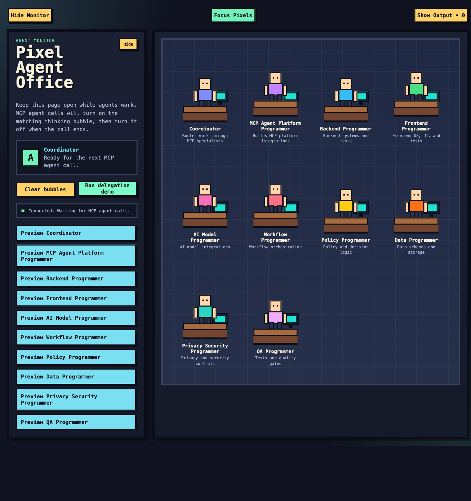

# Agent Workforce

Agent Workforce installs a coordinator and a set of focused specialist agents for ForgeCode. The coordinator delegates backend, frontend, AI, workflow, policy, data, privacy/security, QA, and MCP platform work through generated MCP tools, then synthesizes the results.

It ships as two commands:

- `agent-workforce`: installation, lifecycle management, Forge session launch, diagnostics, and Pixel Agent Office.
- `agent-workforce-mcp`: the stdio MCP server used by the generated specialist integrations.

Both commands are required for the complete workflow.



## Features

- One coordinator command for starting a ForgeCode session.
- Nine focused MCP specialists with shared product contracts.
- Safe, manifest-tracked installation and uninstall behavior.
- Custom agent overrides and activation management.
- A localhost-only Pixel Agent Office showing agent state and delegated Forge output.
- Machine-readable JSON output for automation-oriented commands.

## Requirements

- macOS or Linux on `amd64` or `arm64`.
- ForgeCode with the `forge` command available on `PATH` for installation and live sessions.
- Go 1.25.13 or newer only when building from source.

## Install the commands

### Release archive

Download the archive for your platform from GitHub Releases. Every archive contains both executables, this README, the project license, and third-party notices.

```sh
tar -xzf agent-workforce_v0.1.0_linux_amd64.tar.gz
install -m 0755 agent-workforce_v0.1.0_linux_amd64/agent-workforce* "$HOME/.local/bin/"
export PATH="$HOME/.local/bin:$PATH"
agent-workforce --version
```

Replace the archive name with the release and platform you downloaded. Compare the archive against its adjacent `.sha256` file before installing it.

### Build from source

```sh
git clone https://github.com/donske07/agent-workforce.git
cd agent-workforce
make install
export PATH="$HOME/.local/bin:$PATH"
agent-workforce --version
```

`make build` writes development binaries to `./bin`. `make install` verifies the project, builds both commands, and copies them to `~/.local/bin` by default. Override the destination with `make install BINDIR=/your/bin`.

## Configure ForgeCode

Installing the commands and installing the ForgeCode assets are separate steps.

```sh
agent-workforce install --yes
agent-workforce doctor
```

The install command writes package-owned agent and skill files into the Forge config directory, generates specialist MCP configuration under `~/.agent-workforce/mcp`, and records owned files in `~/.agent-workforce/manifest.json`.

Forge config path precedence:

1. `--forge-config`
2. `FORGE_CONFIG`
3. `~/forge`

Preview the exact actions without ForgeCode or filesystem changes:

```sh
agent-workforce install --dry-run --skip-forge-validation
```

## Start working

Start ForgeCode with the coordinator and forward any remaining arguments:

```sh
agent-workforce new
agent-workforce new -p "Review this repository and propose the smallest safe implementation plan"
```

Manage the installed agents:

```sh
agent-workforce agents list
agent-workforce agents validate
agent-workforce agents deactivate frontend-programmer
agent-workforce agents activate frontend-programmer
agent-workforce agents sync
```

Use `agent-workforce --help` or `agent-workforce <command> --help` for the complete command reference.

## Pixel Agent Office

```sh
agent-workforce office
```

Open `http://127.0.0.1:8765`. The Office is restricted to loopback hosts and same-origin browser requests because it can display delegated prompts and command output. It intentionally cannot bind to a public or LAN interface.

## How it fits together

```text
agent-workforce new
        |
        v
ForgeCode coordinator
        |
        +--> generated MCP specialist tool
        |          |
        |          v
        |     agent-workforce-mcp
        |          |
        |          v
        |     focused ForgeCode agent
        |
        +--> Pixel Agent Office (localhost only)
```

Bundled source assets are compiled into the executables. Runtime state and user-authored custom agents live under `~/.agent-workforce`; ForgeCode integration files live under the selected Forge config directory.

## Update and uninstall

```sh
agent-workforce update --yes
agent-workforce uninstall --yes
```

Uninstall removes only package-owned installed projections recorded by the manifest. It preserves user-authored custom agent source files unless `--remove-state` is explicitly supplied.

## Development

```sh
make verify
make build
./bin/agent-workforce --help
```

See `CONTRIBUTING.md` for the development and pull-request workflow, `SECURITY.md` for private vulnerability reporting, and `THIRD_PARTY_NOTICES.md` for dependency licensing.

## Security notes

- Treat ForgeCode configuration, environment variables, and editor configuration as trusted local input.
- Do not expose Pixel Agent Office through a reverse proxy or non-loopback bind.
- MCP messages and Office request bodies are size-bounded, and deletion paths are validated before filesystem operations.
- Report vulnerabilities privately using `SECURITY.md`.

## Project license

Agent Workforce is available under the MIT License. See `LICENSE` for the full terms. Third-party dependency licenses are listed separately in `THIRD_PARTY_NOTICES.md`.
